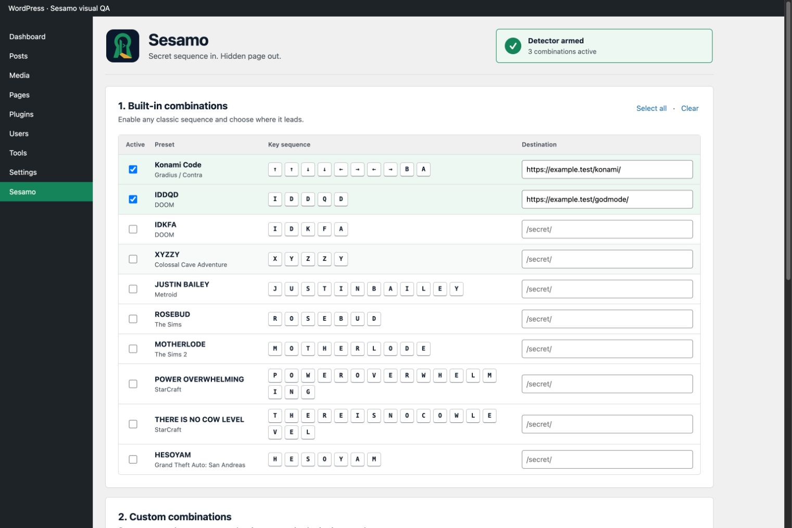

# Sesamo

[](https://github.com/enuzzo/sesamo/actions/workflows/ci.yml)
[](https://wordpress.org/)
[](https://www.php.net/)
[](#good-citizen-mode)
[](#what-it-refuses-to-do)
[](LICENSE)

> *“What if a WordPress page had no menu item, no button, and the only key was muscle memory from 1993?”*
>
> — someone who considers discoverability a negotiable feature

**Unlock a hidden WordPress page with a secret key sequence. Konami Code, IDDQD, or your own combo. Easter eggs, done properly.**

**Sesamo** is an open-source WordPress easter-egg plugin by **Netmilk Studio sagl**. Pick a legendary keyboard sequence or record your own, point each combination at a page on your site, and carry on pretending those pages do not exist. Visitors type the right incantation; Sesamo opens the right door.

*Why “Sesamo”?* Because “Open Sesame” has had excellent backwards compatibility since roughly the 10th century. Also because `↑ ↑ ↓ ↓ ← → ← → B A` is a terrible password and a magnificent doorbell.

<p align="center">
  
</p>

<p align="center">
  <a href="#what-it-does">Features</a> ·
  <a href="#the-roster">Cheat codes</a> ·
  <a href="#make-your-own-magic-word">Custom combos</a> ·
  <a href="#install">Install</a> ·
  <a href="#good-citizen-mode">Security</a> ·
  <a href="#development">Development</a>
</p>

---

## Why this exists

WordPress already has enough plugins trying to become a dashboard, a cloud platform, a CRM, and a lifestyle brand before breakfast. Sesamo is not joining them.

It listens for a bounded sequence of keys and opens a same-site URL. That is the product strategy. Our imaginary investors are furious.

The actual use case is delightfully specific: campaign easter eggs, hidden launch pages, private jokes, alternate portfolios, credits screens, internal demos, or the page your client insists should be “secret, but fun.” Install one small plugin, choose a classic cheat code or invent your own, and give the site a piece of muscle memory.

If you are protecting payroll with `IDDQD`, however, this README cannot save you.

## What it does

- arms any combination of ten built-in classics or up to twenty custom sequences;
- routes every combination to its own same-origin WordPress destination;
- records custom keys accessibly or accepts explicit `KeyboardEvent.key` tokens;
- disables duplicate, prefix, and suffix collisions instead of guessing which door you meant;
- ignores inputs, textareas, selects, content-editable regions, repeated keys, IME composition, and modified shortcuts;
- resets a partial sequence after a configurable 250–5,000 ms pause;
- emits a cancelable `sesamo:matched` browser event before navigation;
- loads **zero frontend JavaScript** when no sequence is active;
- stores one schema-versioned, normalized option and deletes it on uninstall;
- makes no remote requests and brings no runtime dependencies to the party.

## The roster

| Sequence | Origin | Type this |
| --- | --- | --- |
| Konami Code | Gradius / Contra | `↑ ↑ ↓ ↓ ← → ← → B A` |
| IDDQD | DOOM | `IDDQD` |
| IDKFA | DOOM | `IDKFA` |
| XYZZY | Colossal Cave Adventure | `XYZZY` |
| JUSTIN BAILEY | Metroid | `JUSTINBAILEY` |
| ROSEBUD | The Sims | `ROSEBUD` |
| MOTHERLODE | The Sims 2 | `MOTHERLODE` |
| POWER OVERWHELMING | StarCraft | `POWEROVERWHELMING` |
| THERE IS NO COW LEVEL | StarCraft | `THEREISNOCOWLEVEL` |
| HESOYAM | GTA: San Andreas | `HESOYAM` |

Spaces in phrase-like codes are omitted. Sesamo is listening to keys, not writing a memoir.

## Make your own magic word

Built-in cheat codes are excellent cultural infrastructure. Sometimes you need a door only your particular group of nerds would think to knock on.

Create up to twenty custom combinations. Each one gets:

- a human name, because `custom_91de3b2d31f96c0a` is technically memorable only to a database;
- an accessible key recorder plus editable `KeyboardEvent.key` tokens;
- its own same-site destination;
- an independent enabled switch;
- collision checks against every active built-in and custom sequence.

Try `s e s a m o`, `v a u l t`, or the name of the office Wi-Fi nobody remembers. Sesamo accepts printable single-key tokens and a deliberately small named-key set. It does not accept JavaScript, callbacks, macros, shell commands, or your pitch for a blockchain-powered shortcut marketplace.

## What it refuses to do

- become access control;
- phone home;
- collect analytics;
- set cookies;
- create database tables;
- fetch remote presets;
- intercept typing fields;
- ship a framework to compare sixty-four tiny strings;
- ask you to create an account for a keyboard shortcut.

Some restraint was involved. We are as surprised as you are.

## Good citizen mode

Sesamo is an **easter egg, not authentication**. The destination URL is shipped to the visitor’s browser and is therefore discoverable. If a page contains sensitive material, protect it with WordPress permissions, HTTP authentication, or another real access-control layer. Obscurity is delightful theatre; it is not a lock.

The plugin deliberately has no cookies, analytics, telemetry, external calls, database tables, remote preset feeds, or third-party frontend code. Destination URLs are restricted to the current site, normalized on save **and** read, and revalidated in the browser before navigation.

See [SECURITY.md](SECURITY.md) and the [security assessment](docs/SECURITY-ASSESSMENT.md) for the less whimsical version.

## Install

From a release ZIP:

1. open **Plugins → Add New → Upload Plugin**;
2. upload the downloaded `sesamo-vX.Y.Z.zip` and activate it;
3. open **Settings → Sesamo**;
4. choose or record combinations, assign their destinations, and set the timing;
5. save, then type like it is 1993.

For development, clone the repository as `wp-content/plugins/sesamo/`.

## Browser event

```js
window.addEventListener("sesamo:matched", (event) => {
  console.log(event.detail.combination.id, event.detail.destinationUrl);

  // event.preventDefault(); // keep the door closed
});
```

`event.detail.combination` identifies the matched built-in or custom route. The compatibility `event.detail.preset` projection and pre-release event name `konami-code-activator:matched` remain available through the 0.x line. Either event may cancel navigation.

## Under the tiny hood

```text
schema-versioned WordPress option
        ↓
built-in registry + bounded custom combinations
        ↓
per-route same-origin config + collision-safe bounded matcher
        ↓
cancelable event
        ↓
no-referrer navigation
```

There is no service, cron job, shortcode, REST route, cookie, or custom table. Sesamo has one job and has resisted the industry’s repeated attempts to give it Kubernetes.

## Performance, or lack of drama

The browser receives at most thirty routes: ten built-ins and twenty custom combinations. Every custom sequence is capped at sixty-four normalized keys. The matcher keeps one bounded rolling buffer, does no polling, and disappears entirely from the frontend when nothing is armed.

No framework. No bundle step. No hydration. No tiny spinner apologizing for loading the concept of pressing `B`.

## Development

Requirements: PHP 7.4+, Node.js 18+, and WordPress 6.3+ for integration testing.

```bash
npm test
./scripts/build-release.sh
sesamo_version="$(node -p "require('./package.json').version")"
unzip -l "build/sesamo-v${sesamo_version}.zip"
```

The release ZIP is allowlisted from runtime files, SHA-256 checksummed, and version-checked across the plugin header, runtime constant, `package.json`, WordPress stable tag, and changelog. Git tags and archive names use `vMAJOR.MINOR.PATCH`; plugin metadata uses plain `MAJOR.MINOR.PATCH`. No more guessing which `sesamo.zip` was the final-final-one.

Read [SPECIFICATION.md](SPECIFICATION.md), [ARCHITECTURE.md](ARCHITECTURE.md), [AGENTS.md](AGENTS.md), and [docs/GOTCHAS.md](docs/GOTCHAS.md) before changing public behaviour. Release mechanics live in [docs/RELEASING.md](docs/RELEASING.md).

## Status

`0.2.0` is the first feature-complete prerelease, not a victory parade. It has unit/smoke coverage and reproducible packaging; `1.0.0` remains reserved for acceptance-complete WordPress integration, accessibility, mobile-admin, and Plugin Check verification.

## License

GPL-2.0-or-later. See [LICENSE](LICENSE). Copyright © 2026 Netmilk Studio sagl.
